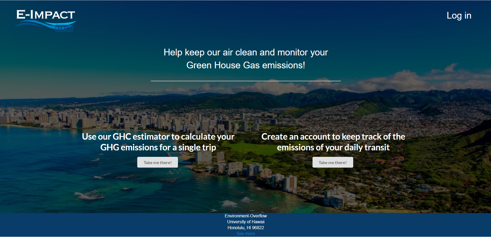

 
 ## Overview
 
 Our task were to create an application that such that the user can easily track their data and how much greenhouse gas they are reducing, with the goal of inspiring more people to be environmentally conscious and take actions in reducing their greenhouse gas emissions. The application hopes to also reduce vehicle miles traveled and facilitate the education and adopption of alternate fuel vehicles.
 
## Current contribution 

My current contribution for the project has so far been creating the main dashboard that the user will see when they log in. The dashboard contains various data with graphs to visualize those data. The data includes things such as the total miles they saved, the total amount of fuel they savevd, and even a monthly report where it shows how much greenhouse gas the reduced.

## Link to Github Organization page
[Github Organization](https://github.com/environment-overflow)
