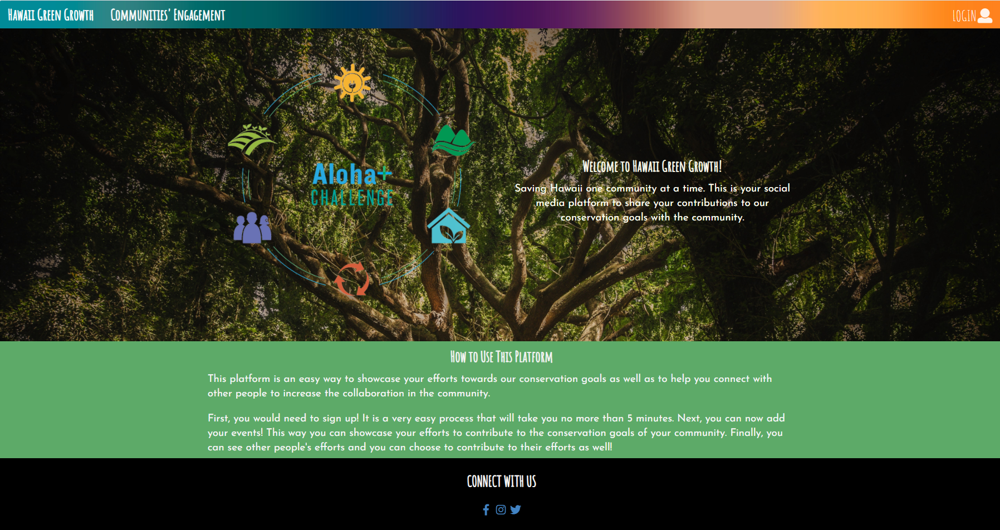

 
 ## Overview
 
The project was supposed to be an easy way for people to see various community events happening around them that were helping to strive towards the Aloha+ Challenge goals. Users can also create events that can be seen by anyone and others could sign up for (i.e. beach cleanup).
## My Contribution

My contributions were to create the event page where it would list the various events created by people. 

## Link to Github Project page
[Github Organization](https://github.com/HACC2019/600-iq)
