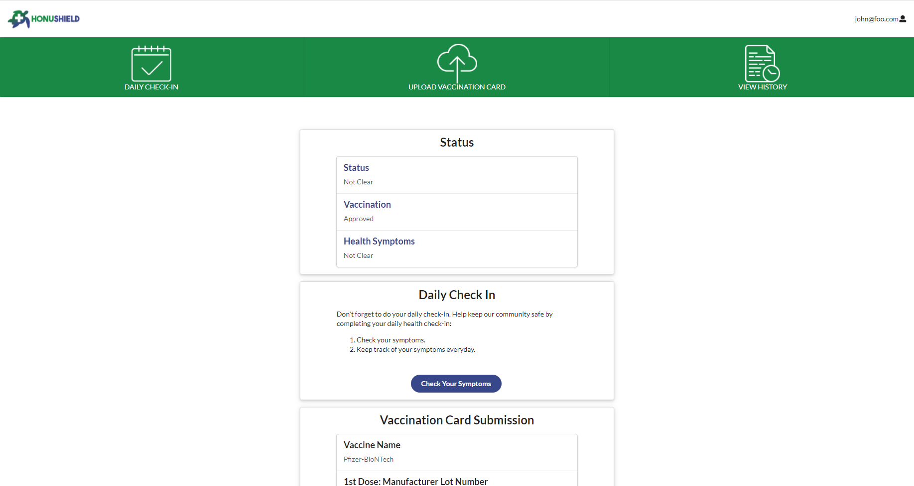

## Links
[Deployed App](https://honushield.meteorapp.com/#/)

[Github Pages](https://rexter-ds.github.io/assignment01-github-pages/)

[Github Repo](https://github.com/darleneagbayani/ICS491)

## Overview

This web app was made as an assignment for my ICS 491 (Special Topics) class. The task was to recreate a web app called [Lumisight](https://uh.campus.lumisight.com/). The purpose of the web app is to allow for a user to perform daily health screenings in the form of a check-in. The user would read through a questionnaire and they would answer with a yes or no. Depending on the answer they would be suggested that they should either stay home or they are okay to go outside. 

The web app allows the user to be able to submit multiple check-ins per day in the case that a user's health were to change. The web app also allowed for the user to track their daily check-in by having a history page that listed all the check-ins they have done.

The last feature of the web app is to be able to submit the details of their vaccine card as well as upload a photo of the card.

## Contribution

For this web app, I was tasked in creating the daily check-in page that allows for the user to submit their check-in for the day. I also created the check-in history page that allows the user to view the check-ins that they have submitted. 

## What I learned

What I learned from this task was how to implement Boostrap for styling. During the start of the project, our team was deciding whether to use Boostrap or use Semantic UI which we were all familiar with as it was the first styling we learned. 

Although we eventually had to switch back to the use of Semantic UI, I still learned a bit of how to implement Bootstrap and got quite familiar with it.

