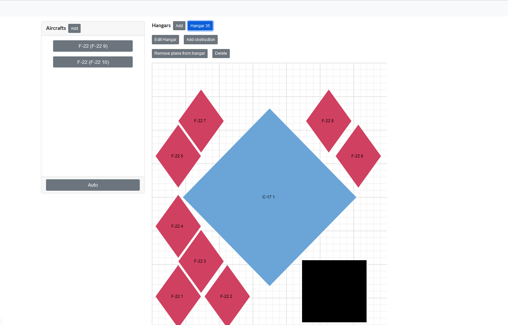

## Links

[Deployed App](https://aircraft-hangar.xyz/)

[Github Repo](https://github.com/AircraftHangar491/aircraft-hangar)

## Overview

The current process for protecting valuable air assets for impending hurricanes is inefficient, expensive, and disorganized. 

The goal of the project is to improve this process by creating a software that would allow for automatic placement of aircraft to hangars.

The project also had a few limitations that were put in place due to us working with the U.S. Airforce, such as that the application must be entirely client-sided as we cannot have a software running in their server while communicating with unapproved third-party servers. 
  
## Contributions

My contributions to the project was as a software lead as I had the most experience with programming as well as creating most of the features of the web application such as the algorithm that would automatically place the planes in the list into all the hangar available. I was also tasked with delegating what features or tasks my teammates could do based on their experienced. As an example, I had one of my teammates design what the UI should look like.

## Learning experience

I learned quite a bit about how it feels to lead a team to create a software project as well as how to effectively delegate certain tasks that plays into the strength of the person while also challenging them enough to be able to learn from it.

What I would do in order to create a better end-project if there were no limitations was to create a server back-end that would be able to store the data as well as handle more extensive processes so that the application would be more accurate and efficient.

