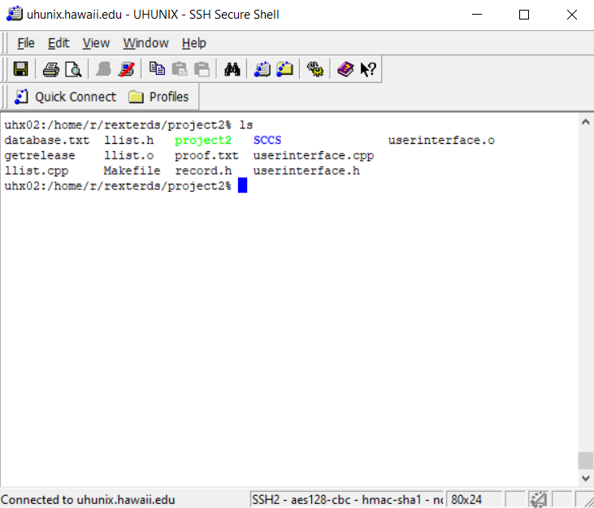

## What is it?

This project was made during Spring of 2019 for my ICS 212 class. We were assigned to make a bank system that stored the user's data, such as their account number, name, and address that would then be stored in a database. The database uses a linked list data structure that made it easy to access the many different user data. 

The system was also required to have many features in it, such as the ability to add a new user, print either a specific user's data or every user's data, finding a specific user, deleting a user's data, and reversing the whole list.

The project also required us to use SCCS, which was a form of version control system for UNIX. This leads to the other requirement where if someone were to pull out the program from the SCCS, the program should still be able to run.

## What did I learn?

This project was a very fun one to do because I had managed to learn so much from it. Not only did I learn C and C++, I had also learned the importance of first planning out what each part of the code should do and using pseudocode to find a way to implement them. I did not really realize how much faster the coding process becomes once everything is planned out because all the thinking has already been done through pseudocode and diagrams, all there needs to be done was to translate it.

I also learned about a feature in C++, called overloaded functions and operators. I thought it was pretty interesting to learn something new in C++ because I have previously worked a lot with C++ during high school when I was part of my school's robotics team.

Here is the code I wrote that overloaded the << operator. This would print out all the data inside the database with a simple cout << database

```
ostream& operator<<(ostream &os, llist &obj)
{
    record *temp = obj.start;

    while (temp != NULL)
    {
        os << "Account Number: " << temp->accountno << endl;
        os << "Name: " << temp->name << endl;
        os << "Address: " << temp->address << endl << endl;

        temp = temp->next;
    }

    return os;
}
```
