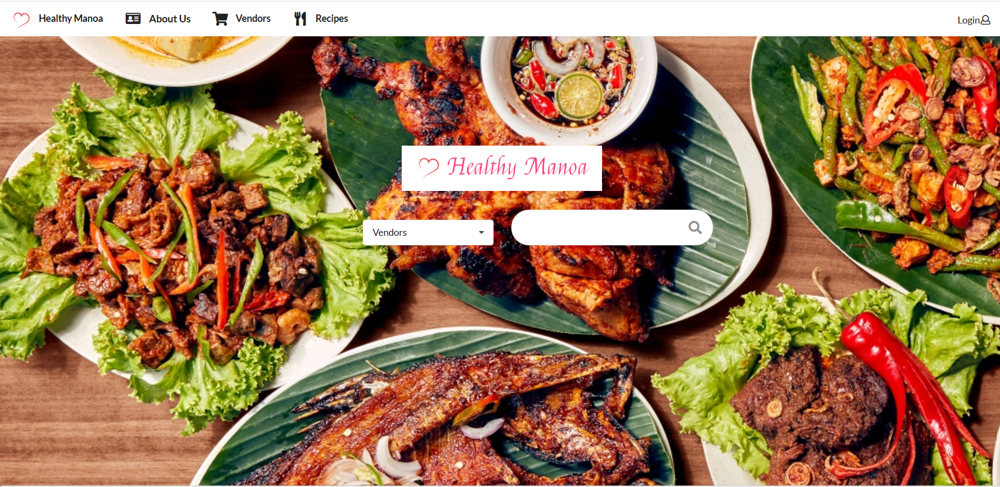

 
## Overview
 
For a final project in my ICS 314 class, we were tasked in solving a problem that the people in the community of the University of Hawaii at Manoa was facing. We were put into teams and assigned one of the problems to solve, and we were given the task to make a web application to solve a problem that many students face. That issue was that a majority of students have either little to no access to kitchen resources and lack the skill or time to either invest in learning or even going to the grocery store to buy the proper ingredients. This results in many students spending more money to eat out or eat unhealthy but cheap food.

Our solution to this problem was to create a web application that will be an easy way to learn a quick and easy recipe but also a way to easily share a recipe that you know to other people. We also added in a list of stores that sold the ingredients that were used in the recipes. Our solution had originally planned it so that when you clicked an ingredient from a recipe, it would show a list of stores that sold them along with other information such as price and what time the store was opened, but we did not have enough time to make it happen.

## My Contribution

Our team decided to divide up the work equally and work on what component interested us the most. I mainly worked on the search function of the web application and making it so that it was able to search up both recipes and stores. I also helped out my team members a little with their own share of the workload but where I learned the most was what I was working on. What I learned from this experience was how to use the react router and redirect to pages when an event happened. I also learned how React was passing around data to each component and pages.

## Link to Github Organization page
[Github Organization](https://github.com/healthy-manoa)
