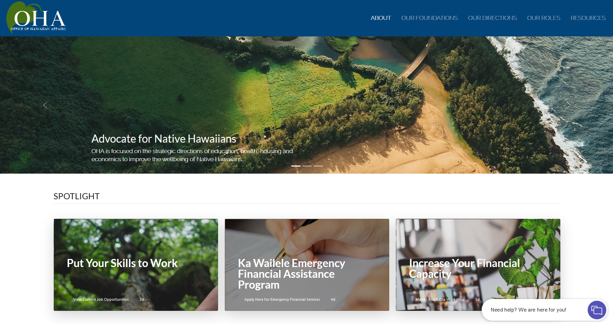
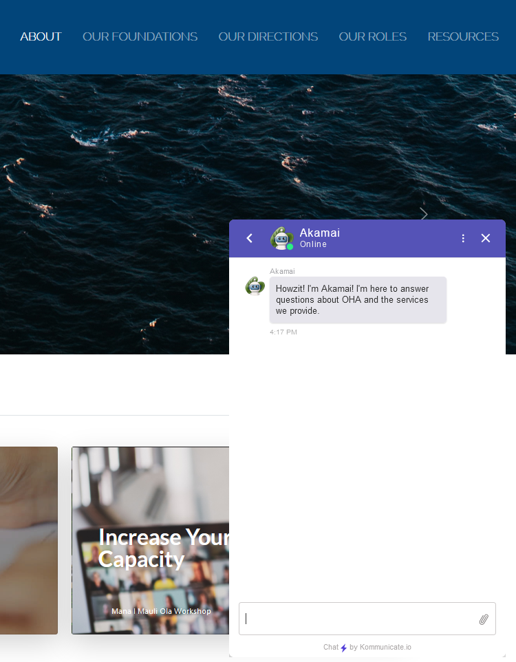

## Links

[Video Demo](https://www.youtube.com/watch?v=437G68KBJPY)

[Github Repo](https://github.com/HACC2021/TeamName404)

[Devpost](https://devpost.com/software/oha-chatbot-team-name-404)

## Overview

A project created for the HACC 2021 Hackathon, for the challenge that was sponsored by the Office of Hawaiian Affairs (OHA). Their issue is that they receive over 13,000 calls annually with 11% of those calls never reaching anyone while 30% of the calls require transfers to other departments. Their challenge was for us to create a chatbot that could alleviate this heavy workload and become an outlet that could provide quick answers to users.

## Contributions

The main meat of the project was to create the Intents in Google's DialogFlow in order for the chatbot to answer questions that users would have about OHA. I was tasked to input these intents for 25% of the topics that OHA covers and that users would most likely have questions about. I also added a secondary feature to some of the intents in order to provide a voice-chat option for the chatbot in order for the chatbot to be accessed via a website or through a phone call. 

## Learning Lessons

The biggest takeaway from this project was the planning of the chatbot and how the intents needed to be structured as the questions might contain common Hawaiian words such as Aina, or Hawaiian words used by OHA such as the Mana I Mauli Ola Strategic Plan. Which meant that the first step of our project required us to create a flow chart of how a typical question and answer should go and if there are any related topics to the question that we should consider.
