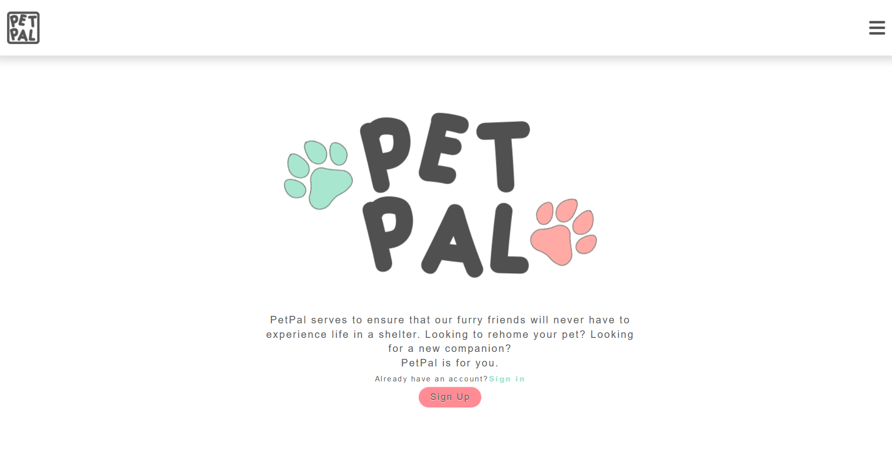
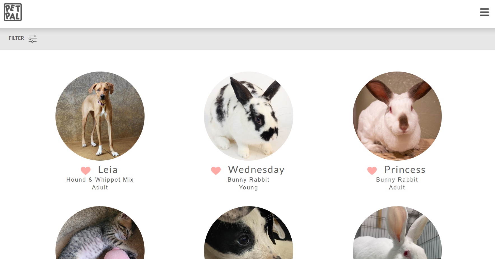

## Links
[Deployed App](https://petpal.meteorapp.com/)

[Github Pages](https://team404-meteor.github.io/PetPal/)

[Github Repo](https://github.com/team404-Meteor/PetPal)

## App Summary

The application is built to assist pet owners and provide them with an alternative way of rehoming their beloved pets besides an animal shelter. The pet owners would list their pets into the site, where a person looking for a pet of their own may contact the owner. 

The current project is pulling from web-scraped data, mainly from PetFinder, in order to populate the various pages of the project with realistic data. For more information about the list of features of the site, you can visit the [Github Pages](https://team404-meteor.github.io/PetPal/).

## Contribution

My contribution for this project was connecting various front-end pages to the data in the back-end. As an example, I worked on the page that lists all the pets that are listed for adoption. In it, I had to pull the data from the MongoDB database in order to populate the list with the various pet data. 

After that was done, I then helped out my teammates with their part of the project such as the user profile page and the pet profile page. The user profile page is where the user would find a list of pets that they have listed for adoption as well as the pets that they added to their "favorites" list. The pet profile page is where the user can find more information about the pet, such as the contact email of the owner, description, age, breed, photos, etc.

I also worked on getting the email notification feature to work by using the built in Meteor email package. The feature works by sending users an email when a pet from their favorites list has been marked as adopted by the owner. The owner can mark the pet as adopted by going to the pet profile of the pet that they listed, then editing the information and changing the status from "Available" to "Adopted". However, our team agreed to have the emails send to a dummy email for now as we did not want to send random emails to random people. Although the "contact email" currently listed for the pets are fake and are generated by FakerJS, there is still the possibility of them being real.

## Lessons

My key takeaway from this experience was the importance of solid planning as well as time management. Since the hackathon was over the course of five days, it was absolutely crucial that our team were on the same page at every step of the way. This meant that we had a nightly meeting each day in order to go through what we finished on that day as well as what needs to happen the next day. Having these meetings kept our group from deviating or getting lost which means lost time.

Time management was an important lesson in this experience as well. There were a few features that I wish I could have polished out a little bit more had I been given the time to, but I had to leave it as "good enough" and move on to implement other features of the application.