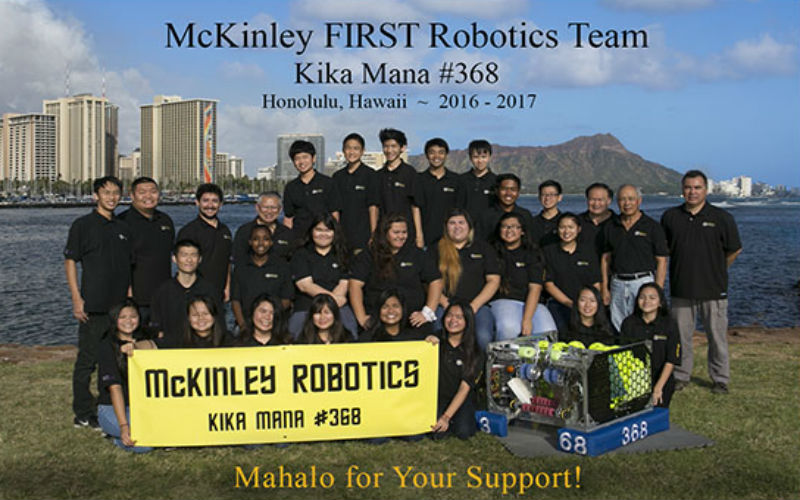

 
 
## What is FIRST Robotics Competition?

FIRST Robotics is an international robotics competition where high schools all over the world build a robot based on requirements under limited time-constraints (six weeks). The teams then compete in various regional competition in their respective city, and the winners then move on to the championships to decide to crown a team as champions.

Every year the competition theme is different which means that teams must build different robots because each theme are wildly different from each other.

## My experience as a student in the team

My experience as a high school participant in the team was amazing to put it simply. It was where I found my passion for programming because I was part of a small team that programmed as well as wired the different components onto the robot that our team built. Although I did not like the hardware side of it, I did very much enjoy the software side because of how complex the code could get over the weeks. It was also where I learned C++ as well as some Java.
