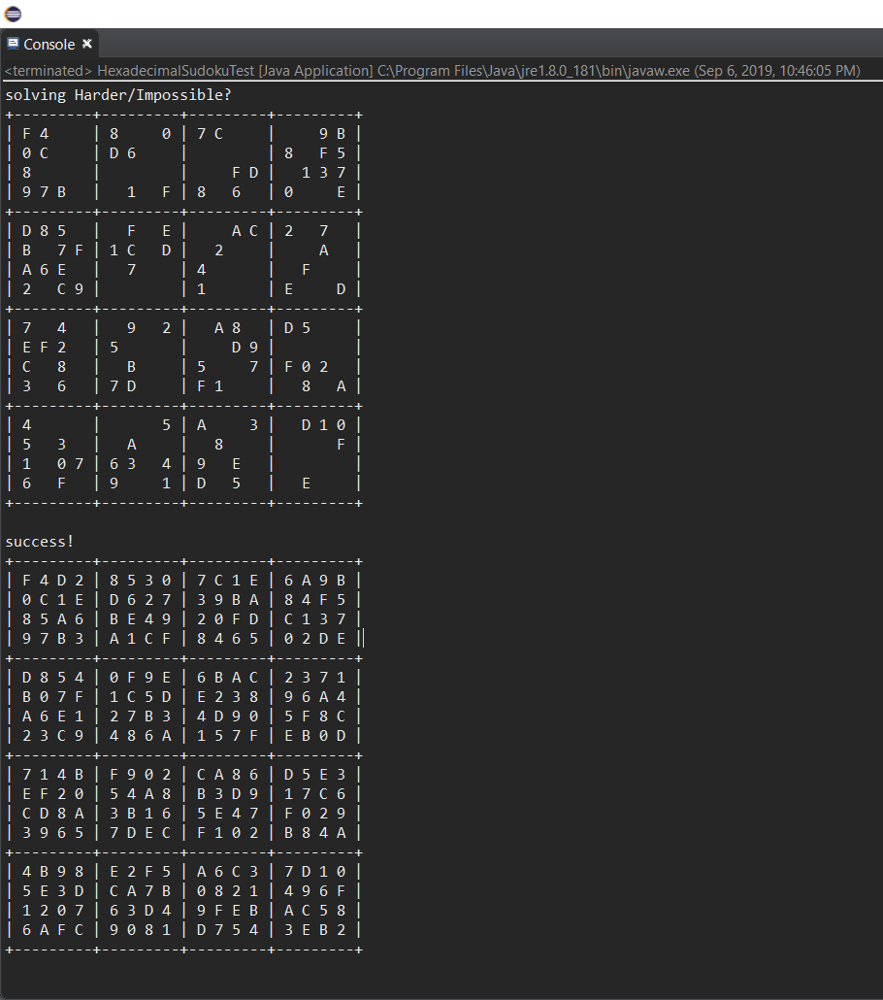

## What is it?

During the Fall 2018 semester of my second year of college, I made a hexadecimal sudoku solver for my ICS 211 class. It was implemented using a backtracking algorithm that would scan for empty cells, go to those empty cell, loop through each valid values, then go to another empty cell and repeat the same steps until the puzzle was solved. 

There was also different levels of complexity to the puzzle which meant some puzzles took a while longer for the algorithm to solve.

## What did I learn?

I learned quite a bit during the process of creating this project. First, I started to notice how helpful using pseudocode before actually coding. I also learned about how the backtracking algorithm worked because it was how I implemented the function that would solve the puzzles. 

Here is the program running and solving a "Harder/Impossible" level puzzle

